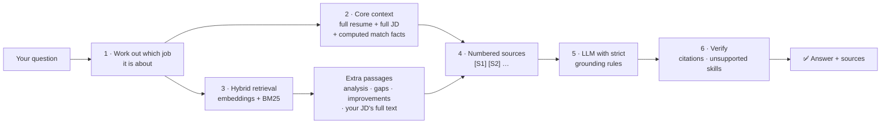

# SkillSync — AI Career Dashboard (Resume ↔ Job Matching with RAG)

SkillSync reads your resume, compares it with real job postings and with **job
descriptions you upload yourself**, and shows you:

- how well you match each job and why,
- which skills you have, which you need to strengthen, and which are missing,
- what to change in your resume, in priority order,
- and an **AI Career Assistant** that answers questions about *your* resume and
  *your* job descriptions, with a source shown for every claim.

The design goal is not "an app that calls an LLM". It is **an assistant that
cannot make things up about you or the job**: every number is calculated in
code, and the AI only writes answers from retrieved passages of your resume and
the job description, which it must cite.

---

## Contents

- [Quick start](#quick-start)
- [Using SkillSync](#using-skillsync)
- [How the AI Career Assistant stays accurate](#how-the-ai-career-assistant-stays-accurate)
- [Measured accuracy](#measured-accuracy)
- [How matching and scores work](#how-matching-and-scores-work)
- [The data](#the-data)
- [Uploading your own job description](#uploading-your-own-job-description)
- [Performance](#performance)
- [API reference](#api-reference)
- [Environment variables](#environment-variables)
- [Project structure](#project-structure)
- [Security and privacy](#security-and-privacy)
- [Troubleshooting](#troubleshooting)
- [The classic session analyzer](#the-classic-session-analyzer)

---

## Quick start

**Requirements:** Python 3.9+ (3.11 recommended), Node 18+, and one LLM key —
**Groq** ([console.groq.com/keys](https://console.groq.com/keys), free tier) or
**Anthropic** ([console.anthropic.com](https://console.anthropic.com/), paid).
The key is only needed for the AI Career Assistant; matching, scores, gaps and
improvements all work without one.

```bash
cd "RAG project"
chmod +x start.sh backend/run.sh
./start.sh
```

The first run creates the Python virtualenv, installs both dependency sets and
copies `backend/.env.example` → `backend/.env`. **Add your key to
`backend/.env`** (`GROQ_API_KEY=gsk_…` or `ANTHROPIC_API_KEY=sk-ant-…`) and run
`./start.sh` again.

| What | URL |
|---|---|
| Homepage | http://localhost:5173/ |
| Dashboard | http://localhost:5173/app |
| API docs | http://localhost:8000/docs |

`./start.sh` starts both servers and keeps them running until you press
**Ctrl+C**. To run it again another day, open a terminal in the project folder
and run `./start.sh` again — nothing else is needed.

<details>
<summary>Running the two servers separately</summary>

```bash
# backend
cd backend
./.venv/bin/python3 -m uvicorn app.main:app --reload --port 8000

# frontend (second terminal)
cd frontend
npm run dev
```

The frontend proxies `/api/*` to port 8000 (`frontend/vite.config.js`).
</details>

---

## Using SkillSync

1. **Pick a resume.** On **My Resume**, upload your own (PDF, DOCX, TXT or an
   image) or choose one of the 10 sample resumes (demo mode).
2. **Add a job description (optional).** Click **Upload Job Description** in
   the top bar — it is on every page — and upload a PDF or paste the text. You
   land straight on your match for that job.
3. **Explore the pages:**

| Page | What it shows |
|---|---|
| **Dashboard** | Resume score, number of job matches, strong matches, skills to improve, your profile, top matches, top gaps, top improvements |
| **My Resume** | Upload a resume or pick a sample; your uploads |
| **Resume Analysis** | Overall score plus ATS Readiness, Skill Relevance, Project Strength, Experience Clarity, Keyword Coverage and Structure; what's working / needs improvement / recommended changes |
| **Job Matches** | Every job ranked by match, with search and filters; your uploaded JDs are pinned first. Each job has a detail view: skills you have (with resume evidence), missing skills, why you match, score breakdown, and how many points each missing skill would add |
| **Skill Analysis** | Your skills vs. a role or a specific job: ✓ Strong, △ Improve, ✕ Missing, with current skill, required skill, gap and recommendation |
| **Improvements** | Prioritised fixes across Resume, Skills, Projects, Experience, Keywords, Job Match and Interview Preparation, plus strong / missing / recommended keywords |
| **AI Career Assistant** | Ask anything about your resume and jobs; answers cite their sources |
| **Saved Jobs**, **Settings** | Bookmarks, dark mode, data controls, data sources |

---

## How the AI Career Assistant stays accurate



**1 · Which job is the question about?** You can choose a job in the
assistant's **Answer about** menu, or click **Ask AI about this job** on any job
page. If you don't, the assistant works it out: a company or job title named in
the question picks that job, and "this job" / "the JD" means your most recently
uploaded job description. Every answer shows which job it was about.

**2 · Core context: the whole resume, not fragments.** A resume is short, so
the model always receives **all of it** — every job, bullet, project,
certification and grade. Earlier versions only sent the top-ranked chunks, and
"Where have I worked?" was refused whenever the experience chunk happened to
rank low. When a job is in focus, the model also gets the **whole job
description** (title, company, salary and other stated details, skills,
responsibilities, requirements) and a **Match facts** source: the skills you
have (with the resume line that proves it), partial skills, missing required
and nice-to-have skills, the score and its breakdown — all computed by the
deterministic engine, not by the model.

**3 · Hybrid retrieval for everything else.** Remaining slots are filled by
retrieval over a vector index of the job dataset, the skill knowledge base,
your uploaded JDs' full text, and your resume analysis, gaps and improvements.
Each passage is scored by **semantic similarity** (all-MiniLM-L6-v2
embeddings) combined with **BM25 keyword relevance** — embeddings alone miss
exact terms like "Kafka" or "CGPA" surprisingly often. When a job is in focus,
passages about *other* jobs are pushed down unless the question compares jobs.

**4 · Numbered sources.** Everything the model sees is labelled `[S1]`,
`[S2]`, … with where it came from (`Resume: …`, `Your JD: …`,
`Match facts: …`, `Skill Gaps: …`).

**5 · Strict grounding rules.** The model is told to: use only the sources;
cite every claim; treat the resume as the only truth about you and the JD as the
only truth about the job; use the Match facts exactly (never call a partial
skill missing); list *all* items when asked for a list; quote numbers and dates
exactly; include conditions the job states (e.g. what counts as experience);
answer "your resume doesn't mention X" when asked about a skill you don't have;
and reply with *"I don't have enough information in the current SkillSync
knowledge base to answer that."* when the sources truly don't contain the
answer.

**6 · Verification.** Citation formats are normalised (`【S2】`, `[4]`,
zero-width characters). If the answer names a skill that appears in **no**
source, the model is asked once to rewrite using only the sources. Off-topic
questions with nothing relevant retrieved are refused without calling the model.

If the LLM is unavailable (no key, rate limit), the assistant says so and shows
the most relevant passages instead of guessing.

### Where it is implemented

| Step | File | Function |
|---|---|---|
| Job inference | `backend/app/skillsync/rag.py` | `infer_job()` |
| Core context | `backend/app/skillsync/rag.py` | `resume_document()`, `job_document()`, `match_document()`, `build_context()` |
| Hybrid retrieval | `backend/app/skillsync/rag.py` | `retrieve()`, `_bm25()` |
| Indexes | `backend/app/skillsync/rag.py` | `kb_index()`, `uploads_index()`, `resume_index()` |
| Prompt + verification | `backend/app/skillsync/rag.py` | `_SYSTEM`, `chat()`, `_unsupported_skills()` |
| Embeddings | `backend/app/rag/embeddings.py` | `get_embedder()` |
| LLM providers | `backend/app/rag/llm.py` | `get_llm()` |

---

## Measured accuracy

`backend/scripts/eval_assistant.py` asks 15 fixed questions about sample
resumes and two test job descriptions, and checks each answer against facts
computed by the engine (not by an LLM):

```bash
cd backend && ./.venv/bin/python3 scripts/eval_assistant.py
```

It covers missing and matched skills for a JD, experience requirements,
optional vs. required skills, employers, certifications, grades, full project
lists, best match, a JD's salary, a company named in the question, a skill the
candidate doesn't have, and two questions that must be refused.

| Metric | Before (chunks only) | After (current) |
|---|---|---|
| Expected facts found in answers | 78% | **100%** |
| Skills mentioned that no source supports | 0 | **0** |
| Answers that cite sources | 9 of 12 | **15 of 15** |
| Unanswerable questions correctly refused | 2 of 2 | **2 of 2** |
| Personal questions wrongly refused ("Where have I worked?", "Do I have Rust?") | 2 | **0** |

The script makes about 15 real LLM calls, so it uses your provider quota. Run
it after changing prompts, retrieval or the skill dictionary.

---

## How matching and scores work

**Every number is computed in Python, so it is instant, repeatable and
explainable.** The LLM is only used to write chat answers.

### Job match score

| Component | Weight | How |
|---|---:|---|
| Required skills | 55% | Share of the job's required skills you cover. Full credit for the skill itself or a specific skill that satisfies a generic one (AWS → "Cloud Platforms"); 40% credit for a closely related skill (SQL → PostgreSQL) |
| Preferred skills | 15% | Same, for nice-to-have skills |
| Role focus | 15% | 100% if the job is in your target role; otherwise TF-IDF similarity between your resume and the posting |
| Experience | 15% | Your years vs. the job's stated minimum (months are understood, e.g. "10 months") |

75%+ is a **Strong match**, 60%+ **Good**, 45%+ **Fair**.

### Skill status

| Status | Meaning |
|---|---|
| ✓ **Strong** | You have it **and** it appears in a job bullet, project or certification |
| △ **Improve** | Listed in your skills but never demonstrated, or you only have a related skill |
| ✕ **Missing** | Not in your resume |

Skills are only counted from your skills list, experience, projects and
certifications — **not** from your summary, which often states goals
("keen to work on distributed systems").

### Resume analysis

ATS Readiness (standard sections found), Skill Relevance (average required-skill
coverage for your target role), Project Strength (tech listed, description,
outcome, link), Experience Clarity (action-led, non-vague bullets with numbers),
Keyword Coverage (core role keywords present) and Structure (summary length,
bullets per role, projects, certifications). The overall score is a weighted
average. Code: `backend/app/skillsync/engine.py`.

---

## The data

All data is plain JSON in `/data`, so you can edit it. Changes are picked up on
the next request — no restart, no rebuild.

```
data/
├── index.json              # lists every resume and job file, with a version
├── skills.json             # 144 skills: category, description, aliases, how to learn
├── resumes/
│   └── resume-01.json … resume-10.json
├── jobs/
│   └── java-developer.json, full-stack-developer.json, web-developer.json,
│       cloud-engineer.json, devops-engineer.json, cybersecurity-analyst.json,
│       data-scientist.json, ui-ux-designer.json
└── storage/                # created at runtime, git-ignored
    ├── uploads/            # your parsed resumes
    │   └── jobs/           # your uploaded job descriptions
    └── skillsync/          # saved vector indexes (*.npz)
```

**Sample resumes are synthetic.** The 10 resumes (Java, Full Stack,
Frontend/Web, Cloud, DevOps, Cybersecurity, Data Science, UI/UX, Software
Engineer, CS Graduate) describe invented people, employers and `@example.com`
addresses, released as CC0. Each has a `source` field saying so. They include
deliberate weak spots so the analysis has something to find.

**Job postings are summaries, not copies.** The 17 postings across 8 roles were
taken from companies' public job boards (Greenhouse job board API) and
**summarised in our own words**: title, company, location, level, required and
preferred skills, responsibilities and requirements. Each keeps its
`source_url`, `source_name` and `retrieved_at` date, and a note that the role
may no longer be open. The app never claims a company is currently hiring.

**Skill knowledge base.** `skills.json` maps aliases to one canonical name
(`k8s` → Kubernetes, `oop` → Object-Oriented Programming), records which
specific skills satisfy a generic one, and gives a short way to learn each
skill. Add a skill here and it is recognised everywhere: resumes, job
descriptions, matching and the assistant.

---

## Uploading your own job description

Use **Upload Job Description** (top bar, Job Matches, Dashboard). PDF, DOCX,
TXT, a screenshot, or pasted text all work. The parser
(`backend/app/skillsync/jd_parser.py`):

- reads the title, company/organisation, location, work type, salary, grade,
  closing date and experience (in years or months);
- splits **required** from **nice-to-have** skills using the document's own
  headings, including UK-style "Essential criteria" / "Desirable criteria";
- keeps your full text (on your machine) so the assistant can quote it;
- **rejects resumes** uploaded by mistake, and documents with no job
  requirements, with a clear message;
- recognises the same posting uploaded twice (PDF and pasted text) as one job.

Uploaded JDs appear first in Job Matches with a **Your JD** tag, can be chosen
in Skill Analysis and the assistant, and can be removed from their job page.

---

## Performance

- Matching, analysis, gaps and improvements are deterministic and cached per
  resume and dataset version — pages load in milliseconds.
- Vector indexes are built **once** and saved to `data/storage/skillsync/`,
  named by a hash of their content, so they are only rebuilt when the data
  changes. Uploaded JDs live in their own small index, so adding one never
  re-embeds the main knowledge base.
- The embedding model and indexes warm up in a background thread at startup.
- Frontend: every page is a separate lazily loaded chunk; API results are
  cached in memory; hovering a menu item prefetches its page and data; skeleton
  loaders show while data arrives; search is debounced.

---

## API reference

| Method | Endpoint | Purpose |
|---|---|---|
| `GET` | `/api/resumes` | Sample resumes and your uploads |
| `GET` | `/api/resumes/{id}` | One resume profile + completion % |
| `POST` | `/api/resume/upload` | Upload and parse a resume |
| `GET` | `/api/jobs` | Roles and job postings |
| `GET` | `/api/jobs/{id}?resume_id=` | Job detail, with your match when `resume_id` is given |
| `POST` | `/api/jobs/upload` | Upload a job description file |
| `POST` | `/api/jobs/upload-text` | Submit a job description as text |
| `DELETE` | `/api/jobs/{id}` | Remove one of your uploaded job descriptions |
| `GET` | `/api/matches/{resume_id}` | All jobs ranked by match |
| `GET` | `/api/analysis/{resume_id}` | Resume analysis scores |
| `GET` | `/api/skills/{resume_id}?role=&job_id=` | Skill gap analysis |
| `GET` | `/api/improvements/{resume_id}` | Improvements and keywords |
| `GET` | `/api/dashboard/{resume_id}` | Everything the dashboard needs |
| `POST` | `/api/chat` | Ask the assistant: `{question, resume_id, job_id?, history?}` → answer, sources, used sources, job in focus |
| `POST` | `/api/rag/query` | Retrieval only, no LLM — see which passages a query finds |
| `GET` | `/api/rag/status` | Whether the indexes have finished warming up |

Errors are always `{"error": {"code", "message", "hint"}}`, never a stack trace.

---

## Environment variables

All backend-only, in `backend/.env`. Nothing secret ever reaches the browser.

| Variable | Default | What it does |
|---|---|---|
| `LLM_PROVIDER` | `auto` | `auto` \| `anthropic` \| `groq`; `auto` uses whichever key is present |
| `GROQ_API_KEY` | — | Groq key (`gsk_…`), free tier |
| `GROQ_MODEL` | `openai/gpt-oss-120b` | Groq model |
| `GROQ_TPM_BUDGET` | `8000` | Your Groq tokens-per-minute limit; raise it if you upgrade |
| `ANTHROPIC_API_KEY` | — | Anthropic key (`sk-ant-…`) |
| `LLM_MODEL` | `claude-opus-5` | Model used when the provider is Anthropic |
| `EMBEDDING_PROVIDER` | `auto` | `auto` \| `local` \| `hash` |
| `EMBEDDING_MODEL` | `sentence-transformers/all-MiniLM-L6-v2` | Any sentence-transformers model |
| `MAX_UPLOAD_MB` | `8` | Upload size limit |
| `CORS_ORIGINS` | `http://localhost:5173,…` | Allowed frontend origins |

The classic analyzer also uses `LLM_EFFORT`, `LLM_EXTRACTION_EFFORT`,
`VECTOR_STORE`, `CHUNK_SIZE`, `CHUNK_OVERLAP`, `RETRIEVAL_TOP_K` and
`SESSION_TTL_HOURS`.

---

## Project structure

```
RAG project/
├── start.sh                         # starts backend + frontend
├── data/                            # editable dataset (see "The data")
├── backend/
│   ├── requirements.txt             # full install (MiniLM embeddings)
│   ├── requirements-lite.txt        # no PyTorch; hashing embedder fallback
│   ├── scripts/eval_assistant.py    # assistant accuracy check
│   └── app/
│       ├── main.py                  # app factory, error handling, warmup
│       ├── api/routes/skillsync.py  # SkillSync API
│       ├── skillsync/               # ◀── SkillSync
│       │   ├── dataset.py           # loads /data, reloads on change
│       │   ├── skills.py            # skill vocabulary and aliases
│       │   ├── engine.py            # matching, scores, gaps, improvements
│       │   ├── parser.py            # resume upload → JSON
│       │   ├── jd_parser.py         # job description upload → JSON
│       │   └── rag.py               # indexes, retrieval, grounded chat
│       ├── rag/                     # shared: extraction, embeddings, LLM
│       │   └── …                    # + the classic analyzer's pipeline
│       └── services/, models/, …    # classic analyzer
└── frontend/
    └── src/
        ├── App.jsx                  # routes (lazy loaded)
        ├── pages/Landing.jsx        # homepage
        ├── pages/HowItWorks.jsx     # How It Works page
        └── skillsync/               # ◀── SkillSync dashboard
            ├── Layout.jsx           # sidebar, top bar, mobile nav
            ├── components.jsx       # cards, badges, rings, chat, skeletons
            ├── JdUpload.jsx         # job description upload dialog
            ├── api.js, store.jsx, useQuery.js
            └── pages/               # Dashboard, MyResume, ResumeAnalysis,
                                     # JobMatches, JobDetail, SkillAnalysis,
                                     # Improvements, Assistant, SavedJobs, Settings
```

---

## Security and privacy

- **Your files stay on your machine.** Uploaded resumes and job descriptions are
  parsed in memory; only the extracted text/JSON is saved, under
  `data/storage/uploads/`, which is git-ignored.
- **Only short excerpts reach the LLM**, and only when you ask the assistant a
  question.
- **No personal data in the sample set.** All sample resumes are synthetic.
- **Job postings are summarised, not copied,** with a link to the original and
  the date it was captured.
- **Allow-listed file types and size limits** are enforced on the bytes actually
  read; filenames are sanitised and never used as paths.
- **The API key lives only in `backend/.env`** (git-ignored) and is never sent
  to the browser.
- **Model output is never injected as HTML.** Answers are rendered as React
  elements.

---

## Troubleshooting

| Symptom | Fix |
|---|---|
| "The AI model isn't available right now" | Add `GROQ_API_KEY` or `ANTHROPIC_API_KEY` to `backend/.env` and restart. Matching and analysis still work without it. |
| Groq rate-limit message | Free tier allows 8,000 tokens/minute. Wait a minute; the app retries automatically. |
| "This looks like a resume, not a job description" | You used the job-description upload for a resume. Upload resumes on **My Resume**. |
| "We couldn't find any job requirements in that document" | Upload the full posting (with responsibilities and requirements) or paste its text. |
| A JD skill isn't detected | Add it (with aliases) to `data/skills.json`. |
| A job you uploaded as a resume shows up as your best match | Open it in Job Matches and click **Remove this job description**. |
| First assistant answer is slow | The embedding model loads once at startup (up to about a minute on first run). |
| "Couldn't reach the SkillSync server" | The backend isn't running: `./start.sh`. |
| Port 5173 or 8000 already in use | An old server is still running: `lsof -ti:8000,5173 \| xargs kill`, then `./start.sh`. |

---

## The classic session analyzer

The project started as a single-session resume + job description analyzer.
It still works, at `/upload`, `/dashboard`, `/match`, `/assistant`,
`/improvements`, `/interview` and `/roadmap`, with its own API under
`/api/sessions/…`.

Its pipeline (`backend/app/rag/`):

| Stage | File | What it does |
|---|---|---|
| Extraction | `extraction.py` | PDF (pypdf), DOCX (paragraphs and tables), TXT, images (OCR); keeps a page map so citations can name a page |
| Cleaning | `cleaning.py` | Fixes ligatures, bullet glyphs, line-wrap hyphens, repeated headers |
| Sectioning | `sectioning.py` | Detects headings and maps them to canonical sections |
| Chunking | `chunking.py` | Section-aware, overlapping chunks (`CHUNK_SIZE`, `CHUNK_OVERLAP`) |
| Embedding | `embeddings.py` | all-MiniLM-L6-v2, or a hashing fallback |
| Vector store | `vector_store.py` | ChromaDB or a NumPy cosine store, scoped per session |
| Retrieval | `retriever.py` | Dense + BM25 fused with Reciprocal Rank Fusion, then MMR |
| Generation | `prompts.py`, `llm.py`, `generation.py` | Grounded prompts, structured outputs, invented citations dropped |

Its match score (skills 35%, projects 20%, experience 18%, keywords 17%,
education 10%) is also computed in Python, and the LLM explains it afterwards.
Sessions expire after `SESSION_TTL_HOURS`.

---

Built with [FastAPI](https://fastapi.tiangolo.com/), [React](https://react.dev/),
[Vite](https://vite.dev/), [Tailwind CSS](https://tailwindcss.com/),
[sentence-transformers](https://www.sbert.net/), and Claude or Groq for
generation.
